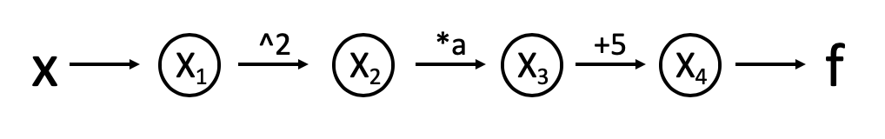
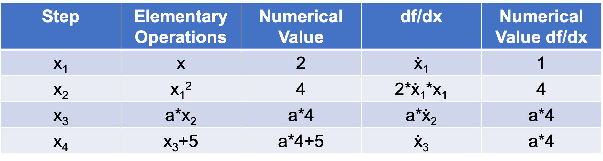

# To do:
- Convert intro to prose
- Capitalize "Jacobian"
- New title

# Milestone 1 Document

## Introduction

This software aims to numerically evaluate the derivative of any function with high precision utilizing automatic differentiation (AD). Specifically, the Jacobian matrix of dimension  of any function  will be computed. Automatic differentiation is different from numerical differentiation and symbolic differentiation, which are introduced in the following:

- Finite differencing equation:
<p align="center"></p>

- Numerical differentiation, i.e., differentiation with the method of finite difference, can become unstable depending on step size and the particular function we're trying to differentiate. The accuracy of finite differencing also depends on choice of step size .

- Symbolic differentiation difficult case:
<p align="center"></p>

- Symbolic differentiation (such as `sympy`) performs well for simple math forms, but symbolic math becomes complex with arbitrary functions, and requires that every function have an analytical representation. This is very computationally expensive and almost never implemented in application.

*Why is AD important?*

- AD dissects each function and its derivatives to a sequence of elementary arithmetic operations (addition, multiplication, subtraction and division) and elementary functions (exp, sin, cos, ln, etc). The chain rule is applied repeatedly on these elementary terms. Because differentiating elementary operations is simple, minimal error is propagated over the process. Efficiency is also maintained because increasing order does not increase computation difficulty.
- AD computes partial derivatives, or the Jacobian matrices, which are one of the most common steps in science and engineering. One important application is optimization, which is extremely useful and implemented in every field such as machine learning.
- AD gives high accuracy, which is an essential requirement to computation because small errors could accumulate in higher dimensions and over iterations and result in catastrophe. 
- AD computes efficiently. Efficiency is very important because the time and energy are usually limited for a particular project. 


## Background

*The Chain Rule*

The chain rule is applied when the derivatives of nested functions are computed. A simple case is , with the derivative 

*The Graph structure*

We can visualize each evaluation step in an AD process with a computation graph. For example, we have a simple function . The computation graph is the following:



*The Evaluation Table*

We can also demonstrate each evaluation using an evaluation table. Using the same example at :



## How to use `autodiff`

High-level interaction with `autodiff` is simple. The core data structure is a `Number`, which stores both a value and a derivative. After instantiation, a number's derivative is `1`:

Using elementary operations will update derivatives according to the chain rule:
```python
>>> import autodiff
>>> x = autodiff.Number(3)
>>> x.value
3
>>> x.deriv[x]
1
>>> y = x**2
>>> y.value
9
>>> y.deriv[x]
6
```

Note that the `deriv` attribute is a dict storing partial derivatives with respect to each `Number` object involved in preceding elementary operations. 

When any elementary operation takes in two `Number()` objects, that elementary operation will return a `Number()` with a partial derivative with respect to every key of both `Number()` objects:

```python
>>> x = autodiff.Number(2)
>>> y = autodiff.Number(3)
>>> def f(x, y, a=3):
>>>     return a * x * y
>>> q = f(x, y, a=3)
>>> q.deriv[x]
9
>>> q.deriv[y]
6
>>> q.deriv
{Number(value=2): 9, Number(value=3): 6}
```

Similarly, `autodiff` can work with vector functions of scalars:
```python
x = autodiff.Number(np.pi / 2)
y = autodiff.Number(3 * np.pi / 2)

def f(x, y):
    return autodiff.array((
        y * autodiff.sin(x),
        x * autodiff.sin(y)
    ))
q = f(x,y)
```
```python
>>>q.deriv[x]
autodiff.array([0, 1])
>>>q.deriv[y]
autodiff.array([1, 0])
```

The `autodiff` package also works for scalar functions of vectors and vector functions of scalars.

Of course, most users will like to work with jacobians and gradients rather than a dict of partial derivatives. Doing so is simple through the `jacobian` method:

```python
>>> x = autodiff.array((1, 2))
>>> y = autodiff.array((3, 4))

>>> q.jacobian((*x, *y))
autodiff.array([3, 4, 1, 2])
>>> q.jacobian((*x, *y)).shape
(4,)
```

Or with a vector function:
```python
>>> x = autodiff.Number(np.pi / 2)
>>> y = autodiff.Number(3 * np.pi / 2)

>>> def f(x, y):
        return autodiff.array((
            y * autodiff.sin(x),
            x * autodiff.sin(y)
        ))

>>> q = f(x,y)
>>> q.jacobian((x, y))
autodiff.array([[0, 1],
                [1, 0]])
```

Note that `autodiff.Number.jacobian()` does require the user to specify an order of input `Number` objects to ensure consistency within the user's own code. Otherwise, `autodiff` would have to infer which element belongs to which function input. As the user strings together multiple elementary operations, it is likely that `autodiff`'s understanding would differ from the user's.

## Software Organization


### Directory structure

```
.
├── README.md
├── .travis.yml
├── setup.py
└── docs
    ├── milestone1.md
    └── image
└── demos
    ├── simple_demo.py
    ├── ...
    └── complex_demo.py
└── autodiff
    └── __init__.py
└── tests
    └── test_autodiff.py
```

#### Modules

- `autodiff`
    - Main package
    - Implements the forward mode of automatic differentiation
- `test_autodiff`
    - Run tests for this package

- The directory `demos` contains a series of demos and examples for using our package, ranging from simple to complex.

#### Testing
- All tests live in `tests/test_autodiff.py`
- We will use both `TravisCI` and `CodeCov` to distribute reports.

#### Installation and packaging
**Subject to change in final package**

1. Ensure setuptools, pip are up to date

    ```bash
    python -m pip install --upgrade pip setuptools
    ```

1. Install package from github

    ```bash
    pip install git+https://github.com/rocketscience0/cs207-FinalProject.git
    ```

3. Set up.

    ```bash
    python setup.py
    ```


Our workflow is based off of this [guide](https://packaging.python.org/tutorials/installing-packages/).

`setup.py` will specify required pieces of metadata, such as the version and dependencies. We will use `setuptools` as a distribution build tool. Why `setuptools` as opposed to `distutils`? As noted by the [Python Packaging User Guide](https://packaging.python.org/guides/tool-recommendations/), `setuptools` is outside the standard library, allowing for consistency across different Python versions. 


Later on, we may publish a final version of our package (currently a Github repo) as an open-source Python package on PyPI. Using pip will allow users to easily install via `pip install autodiff`.


## Implementation

### Core data structures and classes

The `autodiff` package has two core data structures, the `Number` (a scalar that stores a value and a derivative) and the `array`, which subclasses the `numpy.ndarray`. If the user wishes, defining a new type of number is easy:

```python
class NewInt(Number):
    def __init__(self, a, b):
        super(self).__init__(a, b)
        self.value = int(a)
        self.deriv = b
```


### Methods and name attributes
The `Number` class overloads the following common elementary operations:

- `+`
- `-`
- `*`
- `/`
- `**`
- `@`

We have also included the following elementary operations, all of which use their `numpy` counterparts.

- `autodiff.sin()`
- `autodiff.cos()`
- `autodiff.tan()`
- `autodiff.asin()`
- `autodiff.acos()`
- `autodiff.atan()`
- `autodiff.log()`
- `autodiff.exp()`
- `autodiff.sqrt()`

Defining custom elementary functions is straightforward, using the `elementary` decorator (this is the same method we use internally). The decorator takes one input, a function with the same arguments as the elementary operation, but calculates the derivative of the operation rather than the value. We call this derivative function internally.

```python
def my_pow_deriv(a, b):
    """ Returns the derivative of my_pow at a and b
    """
    return b * a ** (b - 1)

@elementary(my_pow_deriv)
def my_pow(a, b):
    return pow(a, b)
```

```python
def sin_deriv(a):
    """ Returns the derivative of the sin() elemental operation"""
    try:
        return a.deriv * np.cos(a.value)
    except AttributeError
        return np.cos(a)
    
@elementary(sin_deriv)
def sin(a):
    try ...
    return np.sin(a)
```

`Number()` overloads `__mul__` and `__rmul__`:
```python
x = Number(2)
y = Number(3)

class Number():
    ...

    def _mult_deriv(self, other):
        try:
            self.deriv[self] * other.value

        except ...

    def __mul__(self, other):
        
        try:
            out = Number(self.value, other.value)
            out.deriv = _mult_deriv(self, other)

        except ...

```