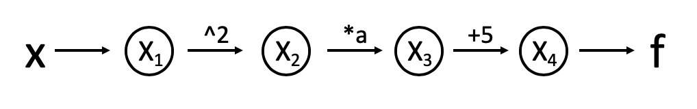
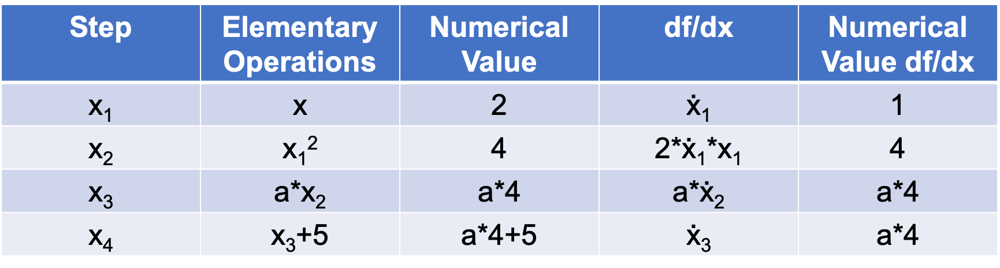

# Milestone 1 Document

## Introduction

This software aims to numerically evaluate the deivative of any function with high precision utilizing automatic differentiation (AD). Specifically, the Jacobian matrix of dimension $ n\times m $ of any function $func: R^m \rightarrow R^n$ will be computed. Automatic differentiation is different from numerical differentiation and symbolic differentiation, which are introduced in the following:

- Finite differencing equation:
$$
f'(x) = \lim_{h \rightarrow 0} \frac{f(x+h)-f(x)}{h}
$$

- Numerical differentiation, i.e., differentiation with the method of finite difference, can become unstable depending on step size and the particular function we're trying to differentiate. The accuracy of finite differencing also depends on choice of step size $h$.

- Symbolic differentiation difficult case:
$$
 f(x,y,z) = \frac{\cos(\exp(\frac{-5x^2}{y}))}{\frac{\sin(x)}{x**3}-erf(z)}
$$

- Symbolic differentiation (such as `sympy`) performs well for simple math forms, but symbolic math becomes complex with arbitrary functions, and requires that every function have an analytical representation. This is very computationally expensive and almost never implemented in application.

*Why is AD important?*

- AD disect each function and its derivatives to a sequence of elementary arithmetic operations (addition, multiplication, subtraction and division) and elementary functions (exp, sin, cos, ln, etc). Chain rule is applied repeatedly on these elementary terms. Because of the simplicity of the derivatizing the elementary terms, minial error is propagated over the process. Efficiency is also maintained because increasing order does not increase computation difficulty.
- AD computes partial derivatives, or the Jacobian matrices, which are one of the most common steps in science and engineering. One important application is optimization, which is extremely useful and implemented in every field such as machine learning.
- AD gives high accuracy, which is an essential requirement to computation because small errors could accumulate in higher dimensions and over iterations and result in catastrophe. 
- AD computes efficiently. Efficiency is very important because the time and energy are usually limited for a particular project. 


## Background

*The Chain Rule*

The chain rule is applied when the derivatives of nested functions are computed. A simple case is $n(x) = g(f(x))$. $n'(x) = g'(f(x))*f'(x)$

*The Graph structure*

We can visualize each evaluation step in an AD process with a computation graph. For example, we have a simple function $f(x) = a*x^2 + 5$. The computation graph is the following:



*The Evaluation Table*

We can also demonstrate each evaluation using an evaluation table. Using the same example at $x = 2$:



## How to use `autodiff`

High-level interaction with `autodiff` is simple:

Using common elementary functions
```python
import autodiff as ad
from autodiff.elementary_functions import elementary
import numpy as np

x = ad.Number(2)

# A sample function
def testfunc(x):
    # return x**2
    return NewElementary(a)

# A function to return a derivative
deriv = ad.diff(testfunc)
deriv_at_x = deriv(x)
```

It is also possible to define vector functions
```python
x = ad.array([1, 2, 3, 4])

def testfunc(x):
    return x.T @ x
```

- Additional ideas:
    - Finding optima?
    - Generating computational graph?

## Software Organization


### Directory structure

```
.
├── README.md
├── setup.py
└── docs
    └── milestone1.md
└── demos
    └── simple_demo.py
    └── ...
    └── complex_demo.py
└── autodiff
    └── __init__.py
└── tests
    └── test_autodiff.py
```

#### Modules

- `autodiff`
    - Main package
    - Implements the forward mode of automatic differentiation
- `test_autodiff`
    - Run tests for this package

- The directory `demos` contains a series of demos and examples for using our package, ranging from simple to complex.

#### Testing
- All tests live in `tests/test_autodiff.py`
- We will use both `TravisCI` and `CodeCov` to distribute reports.

#### Installation and packaging
**Subject to change in final package**

1. Ensure setuptools, pip are up to date
```bash
python -m pip install --upgrade pip setuptools
```

2. Install package from github
```bash
pip install git+https://github.com/rocketscience0/cs207-FinalProject.git
```

3. 
```bash
python setup.py
```


Our workflow is based off of this (guide)[https://packaging.python.org/tutorials/installing-packages/].

`setup.py` will specify required pieces of metadata, such as the version and dependencies. We will use `setuptools` as a distribution build tool. Why `setuptools` as opposed to `distutils`? As noted by the (Python Packaging User Guide)[https://packaging.python.org/guides/tool-recommendations/], `setuptools` is outside the standard library, allowing for consistency across different Python versions. 

In class, we discussed also using the tool `pipenv`, a further abstraction that creates a virtual environment under the hood. Because we do not plan on having a complicated set of dependencies at the moment (nor implementations that rely on specific versions), it is unlikely that we will need a virtul environment. If this becomes an issue, we can manually create a virtual environment or switch over to `pipenv` as needed.

Later on, we may publish a final version of our package (currently a Github repo) as an open-source Python package on PyPI. Using pip will allow users to easily install via `pip install autodiff`.


## Implementation

You can also define custom elementary operations using the `elementary` decorator.

#### Core data structures
The core data structure is a `Number`, which stores a value and a derivative:

```python
x = autodiff.Number(3)
y = x**2
```

```python
>>> print(y.value)
9
>>> print(y.deriv[y])
6
```


Defining a new type of number is easy:

```python
class NewInt(Number):
    def __init__(self, a, b):
        super(self).__init__(a, b)
        self.value = int(a)
        self.deriv = b
```

The `autodiff` package also works for functions with multiple inputs:
```python
x = autodiff.Number(2)
y = autodiff.Number(3)

def f(x, y, a=3):
    return a * x * y

q = f(x, y, a=3)
```
```python
>>> q.deriv[x]
9
>>> q.deriv[y]
6
>>> q.deriv
{x: 9, y: 6}
```
Because `a` does not have a `deriv`, there is no `q.grad[a]`.

It is also possible to return the gradient as an array if the user specifies an order of inputs:
```python
>>> q.deriv.asarray((x, y))
array([9, 6])
```

If a function returns an array:
```python
x = autodiff.Number(np.pi / 2)
y = autodiff.Number(3 * np.pi / 2)

def f(x, y):
    return autodiff.array((
        y * autodiff.sin(x),
        x * autodiff.sin(y)
    ))
q = f(x,y)
>>>q.deriv[x]
autodiff.array([0, 1])
>>>q.deriv[y]
autodiff.array([1, 0])
```

Again, it is possible to get the entire jacobian if the user specifies an order:
```python
>>>q.jacobian((x, y))
autodiff.array([[0, 1],
                [1, 0]])
```


#### Methods and name attributes
The number class overloads the following common elementary operations:

- `+`
- `-`
- `*`
- `/`
- `**`
- `@`

We have also included the following elementary operations

- `autodiff.sin()`
- `autodiff.cos()`
- `autodiff.tan()`
- `autodiff.asin()`
- `autodiff.acos()`
- `autodiff.atan()`
- `autodiff.log()`
- `autodiff.exp()`

Defining custom elementary functions is straightforward, using the `elementary` decorator (this is the same method we use internally).
```python
def my_pow_deriv(a, b):
    """ Returns the derivative of my_pow at a and b
    """
    return b * a ** (b - 1)

@elementary(my_pow_deriv)
def my_pow(a, b):
    return pow(a, b)
```

```python
def sin_deriv(a):
    """ Returns the derivative of the sin() elemental operation"""
    try:
        return a.deriv * np.cos(a)
    except AttributeError
        return np.cos(a)
    
@elementary(sin_deriv)
def sin(a):
    return np.sin(a)
```

#### Classes

`autodiff.array` inherits from `numpy.array`, but also stores the jacobian.
`autodiff.Number` is the base class for a numeric type.

Many elementary operations rely on their `numpy` counterparts, but also include their derivative.