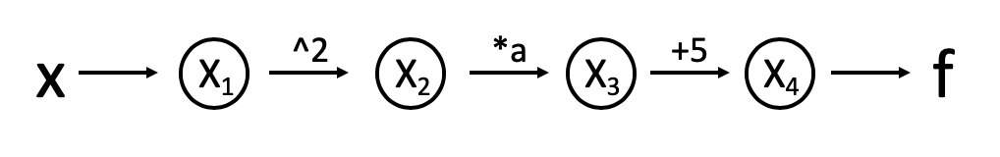

# What is automatic differentiation?

## Introduction

This software aims to numerically evaluate the derivative of any function with high precision utilizing automatic differentiation (AD). Specifically, the Jacobian matrix of dimension `$n \times m$` of any function `$func: \mathbb{R}^m \mapsto \mathbb{R}^n$` will be computed. Automatic differentiation is different from numerical differentiation and symbolic differentiation, which are introduced in the following:

1. Numerical differentiation, i.e., differentiation with the method of finite difference, can become unstable depending on step size and the particular function we're trying to differentiate.

2. Symbolic differentiation:
A difficult example:

```math
 f(x,y,z) = \frac{\cos(\exp(\frac{-5x^2}{y}))}{\frac{\sin(x)}{x^3}-\mathrm{erf}(z)}
```

Symbolic differentiation (such as `sympy`) performs well for simple math forms, but becomes complex with arbitrary functions, and requires that every function have an analytical representation. This is very computationally expensive and almost never implemented in application.

### Why is AD important?

First of all, AD dissects each function and its derivatives to a sequence of elementary functions. The chain rule is applied repeatedly on these elementary terms. Accuracy is maintained because differentiating elementary operations is simple and minimal error is propagated over the process. Efficiency is also maintained because increasing order does not increase computation difficulty.
Also, AD computes partial derivatives, or the Jacobian matrices, which are one of the most common steps in science and engineering. One important application is optimization, which is extremely useful and implemented in every field such as machine learning.
One advantage of AD is high accuracy, which is an essential requirement to computation because small errors could accumulate in higher dimensions and over iterations and result in a catastrophe. 
Another advantage of AD is efficiently. Efficiency is very important because the time and energy are usually limited for a particular project.

## Background

### The Chain Rule

The chain rule is applied when the derivatives of nested functions are computed. A simple case is `$n(x) = g(f(x))$`, with the derivative `$n'(x) = g'(f(x)) \cdot f'(x)$`

### The Graph Structure

We can visualize each evaluation step in an AD process with a computation graph. For example, we have a simple function 

```math
f\left(x\right) = a x^2 + 5
```

The computation graph is the following:



### The Evaluation Table

We can also demonstrate each evaluation using an evaluation table. Using the same example at `$x = 2$`:

```eval_rst
+-------------+-----------------------+-----------------+-----------------------------------------+-----------------------------------------------+
| Step        | Elementary Operations | Numerical Value | :math:`\frac{\mathrm{d}f}{\mathrm{d}x}` | :math:`\frac{\mathrm{d}f}{\mathrm{d}x}` Value |
+=============+=======================+=================+=========================================+===============================================+
| :math:`x_1` | :math:`x`             | :math:`2`       | :math:`\dot{x}_1`                       | :math:`1`                                     |
+-------------+-----------------------+-----------------+-----------------------------------------+-----------------------------------------------+
| :math:`x_2` | :math:`x_1^2`         | :math:`4`       | :math:`2x_1\dot{x}_1`                   | :math:`4`                                     |
+-------------+-----------------------+-----------------+-----------------------------------------+-----------------------------------------------+
| :math:`x_3` | :math:`a x_2`         | :math:`4a`      | :math:`a\dot{x}_2`                      | :math:`4a`                                    |
+-------------+-----------------------+-----------------+-----------------------------------------+-----------------------------------------------+
| :math:`x_4` | :math:`x_3+5`         | :math:`4a+5`    | :math:`\dot{x}_3`                       | :math:`4a`                                    |
+-------------+-----------------------+-----------------+-----------------------------------------+-----------------------------------------------+
```